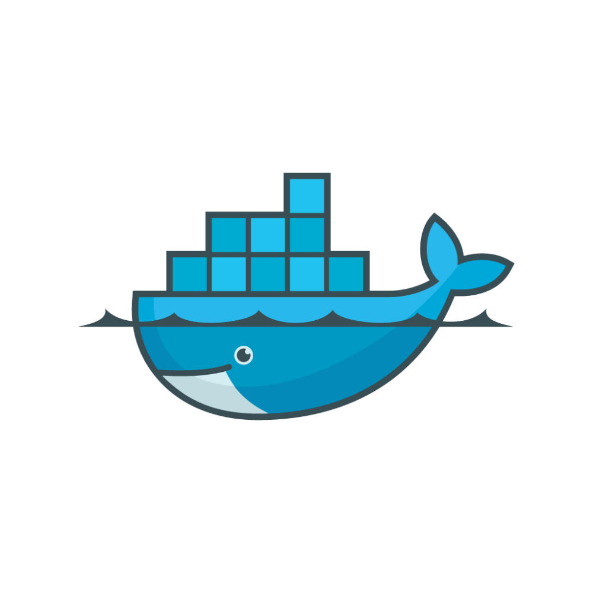

<h1 align="left">🤖whoami
<h3>
<ul align="left">
    <li>👀I'm from VietNam </li>
    <li>🏘️ I live in Hung Yen</li>
     <li>🕋 Studying at Hanoi University of Science and Technology</li>
    <li>❤️I'm passionate about:
         <ul>
          <li>🔐 Cyber Security</li>
          <li>🪐 Operating Systems (Windows & Linux)</li>
          <li>🖥️ Website Developer </> </li>      
        </ul>  
    </li>
</ul> 
</h3>       

<h2 align="left"> 👨🏻‍💻Languages & developer</h2>

<h2 align="left">🖌️Frontend</h2>

<h2 align="left">🖋️Backend</h2>

<h2 align="left">🛰️Databases and cloud hosting</h2>

<h2 align="left">🛠️Others</h2>

<!--  -->

<h2 align="left"> GitHub Stats</h2>

 

         
                      
            
              
                  

